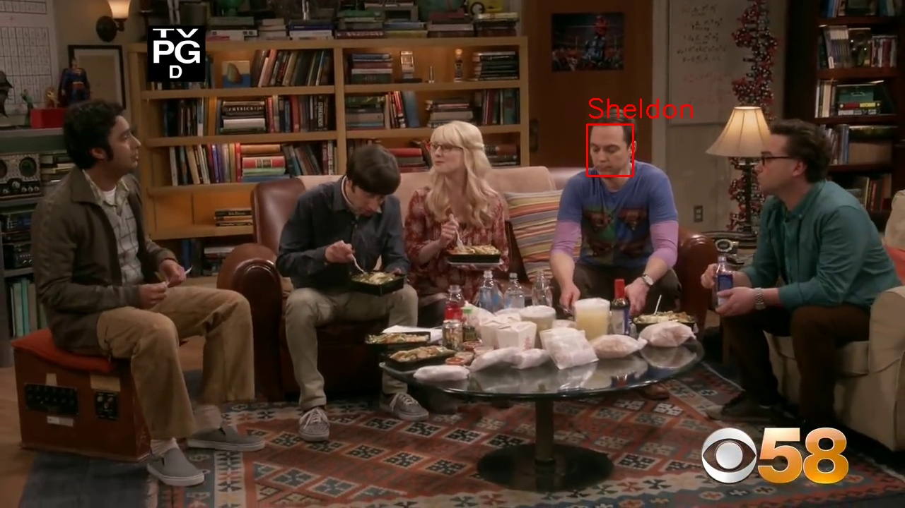
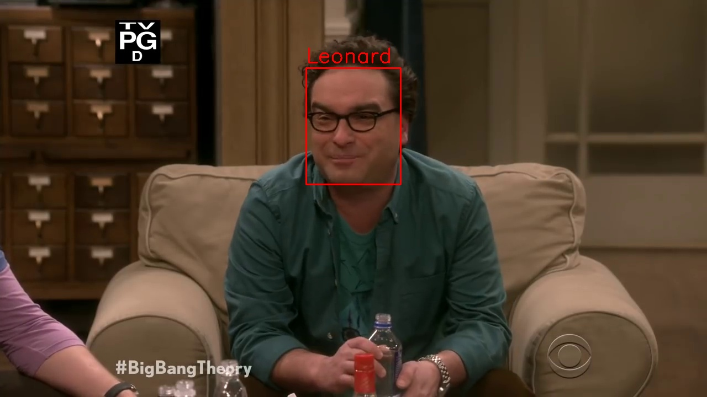

# Faces Detection and Recognition

Implenmentation of opencv face detection and recognition. Uses ResNet-10 pre-trained model to do detection and opencv face API for recognition.

## Implementation Enviroment

OS: Windows 10， X64

Python Version: 3.7 (Anaconda Distribution)

OpenCV Version: 4.1.0

## Files Explanation

"deploy.prototxt.txt" is from [https://github.com/opencv/opencv](https://github.com/opencv/opencv)

"res10_300x300_ssd_iter_140000.caffemodel" is a pre-trained model i got from the internet [https://anonfile.com/W7rdG4d0b1/face_detector.rar](https://anonfile.com/W7rdG4d0b1/face_detector.rar)

## Results

## Implementation Procedures

1. Train the model for recognition: create a folder named "faces", inside this "faces" folder, put the images you want for training in a folder of the name of whom on those images. For example, faces/Sheldon/sheldon_img.jpg , faces/Leonard/Leonard_img.jpg

2. After you arranged all images for training correctly, run train_faces.py. Then you should get two files, one is "model.yml", which is the weights of the trained model to do recognition next. The other one is labbels.pickle, which contains the names of your image folder and int number references as a dictionary.

3. Upon you got those two files. Change the video path to your own one in detect_faces.py, line 9. Also you can change other parameters for different results, all the configurations are well organized as a class at the top lines of detect_face.py you can try another model if you want.

4. Run detect_face.py once you put your video path in the right place. Then you should get the video running and see the results.

## Authors

* **Hehe Zhao**

 [https://github.com/zhaohehe520/Face-Detection-Identification](https://github.com/zhaohehe520/Face-Detection-Identification)

## License

This project is licensed under the MIT License.

## Acknowledgments

This project is inspired by CodingEntrepreneurs, by the way, he makes great tutorial videos on machine learning and all kinds of tech realated stuff, check their videos out by searching his name on youtube. Or click the link below

CodingEntrepreneurs :  [https://www.youtube.com/channel/UCWEHue8kksIaktO8KTTN_zg](https://www.youtube.com/channel/UCWEHue8kksIaktO8KTTN_zg)